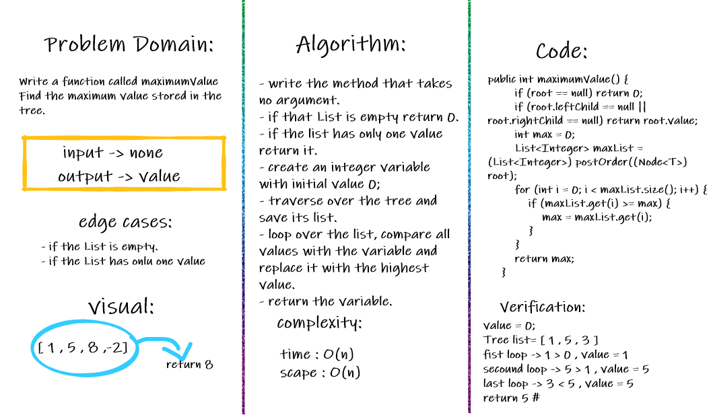
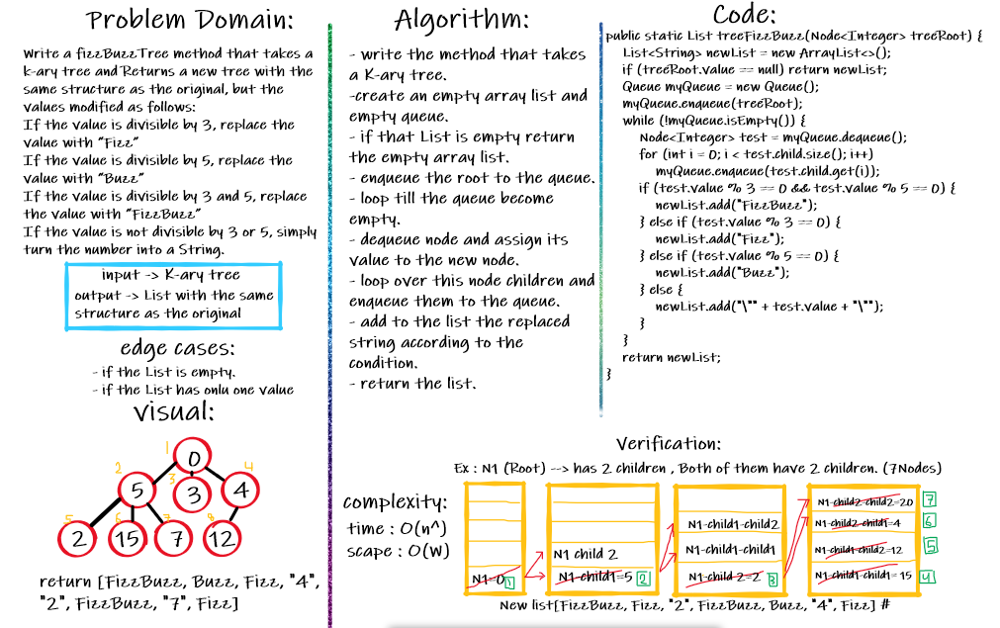

# Trees

A Tree node is a component which may contain it’s own values, and references to other nodes.

- The root is the node at the beginning of the tree
- Left - A reference to one child node, in a binary tree
- Right - A reference to the other child node, in a binary tree
- Edge - The edge in a tree is the link between a parent and child node
- Leaf - A leaf is a node that does not have any children

## Challenge

- **Node** : `Node` class has properties for the value stored in the node, the left child node, and the right child node.

- **Binary Tree class** : `BinaryTree` class Define a method for each of the depth first traversals.

- **Binary Search Tree** : `BinarySearchTree` class is a sub-class of the Binary Tree Class.

**Code raise/throw a custom, semantic error that describes what went wrong in calling the methods.**

## API

**Binary Tree class method :**

- `preOrder()` : prioritize going through the depth (height) of the tree first in order **`root >> left >> right`**.

- `inOrder()`: prioritize going through the depth (height) of the tree first in order **`left >> root >> right`**.

- `postOrder()`: prioritize going through the depth (height) of the tree first in order **`left >> right >> root`** , returns an array of the values, ordered appropriately.

- `maximumValue()`:Find the maximum value stored in the tree.

- `breadthFirst()`: Write a function called breadth first, Returns list of all values in the tree, in the order they were encountered Traverse the input tree using a Breadth-first approach.

**Binary Search Tree method (BST) :**

- `Add()` : Takes a value and adds a new node with that value in the correct location in the binary search tree.

- `Contains()` : Takes a value and Returns a boolean indicating whether or not the value is in the tree at least once.

## Approach & Efficiency

- `Add()`:

Time : O(n).

Space : O(n).

- `Contains()`:

Time : O(n).

Space : O(n).

# Challenge Summary - maximumValue

Write a function called maximumValue Find the maximum value stored in the tree.

## Whiteboard Process

## Approach & Efficiency

time : O(n)
scape : O(n)

# Challenge Summary breadth-first

Write a function called breadth first
Return: list of all values in the tree, in the order they were encountered Traverse the input tree using a Breadth-first approach.

## Whiteboard Process

## Approach & Efficiency

time : O(n)
scape : O(W)

# Challenge Summary breadth-first

Write a fizzBuzzTree method that takes a k-ary tree and Returns a new tree with the same structure as the original, but the values modified as follows:

- If the value is divisible by 3, replace the value with “Fizz”
- If the value is divisible by 5, replace the value with “Buzz”
- If the value is divisible by 3 and 5, replace the value with “FizzBuzz”
- If the value is not divisible by 3 or 5, simply turn the number into a String.

## Whiteboard Process

## Approach & Efficiency

time : O(n^)
scape : O(W)
